# Valkyrie Finance - System Workflow Diagram

```mermaid
graph TB
    %% User Layer
    User[👤 User] --> WebApp[🌐 Web App<br/>Next.js 15<br/>:3001]
    Dev[👨‍💻 Developer] --> Storybook[📚 Storybook<br/>Component Docs<br/>:6006]
    
    %% Frontend Layer
    WebApp --> |tRPC Calls| APIServer[⚡ API Server<br/>tRPC Backend<br/>:3000]
    WebApp --> |Web3 Calls| Blockchain[🔗 Blockchain<br/>Ethereum/Arbitrum]
    WebApp --> UIPackage[🎨 UI Package<br/>@valkyrie/ui<br/>20+ Components]
    
    %% Backend Services Layer
    APIServer --> |AI Analysis| AIEngine[🤖 AI Engine<br/>Go Service<br/>Yield Optimization]
    APIServer --> |Data Storage| Database[(🗄️ PostgreSQL<br/>Drizzle ORM)]
    APIServer --> |Caching| Redis[(📊 Redis<br/>Performance Cache)]
    
    %% AI Engine Components
    AIEngine --> DataCollector[📈 Data Collector<br/>Market Data]
    AIEngine --> YieldAnalyzer[💹 Yield Analyzer<br/>Optimization Logic]
    AIEngine --> RiskAssessment[⚠️ Risk Assessment<br/>Portfolio Analysis]
    
    %% External Data Sources
    DataCollector --> |Price Feeds| DeFiProtocols[🏦 DeFi Protocols<br/>Uniswap, Aave, Compound]
    DataCollector --> |Market Data| PriceOracles[📊 Price Oracles<br/>Chainlink, Pyth]
    
    %% Smart Contracts Layer
    Blockchain --> VaultContracts[📦 Vault Contracts<br/>ERC-4626 Standard]
    Blockchain --> TokenContracts[🪙 Token Contracts<br/>VALKYRIE Token]
    
    %% Database Schema
    Database --> UserData[👥 Users & Auth]
    Database --> PortfolioData[💼 Portfolio Data]
    Database --> TransactionData[📋 Transactions]
    Database --> AnalyticsData[📊 Analytics]
    Database --> VaultData[🏛️ Vault Positions]
    
    %% Development Workflow
    Dev --> |Component Development| UIPackage
    Dev --> |API Development| APIServer
    Dev --> |AI Development| AIEngine
    Dev --> |Testing| TestSuite[🧪 Test Suite<br/>Vitest, Playwright]
    
    %% Deployment Pipeline
    TestSuite --> |CI/CD| Production[🚀 Production<br/>Vercel + Railway]
    
    %% Component Library Workflow
    UIPackage --> |Exports| Components[📦 Components<br/>Button, Card, Dialog, etc.]
    Components --> |Used By| WebApp
    Components --> |Documented In| Storybook
    
    %% AI Workflow Detail
    subgraph "AI Processing Pipeline"
        YieldAnalyzer --> OptimizationEngine[⚙️ Optimization Engine]
        OptimizationEngine --> StrategyRecommendations[💡 Strategy Recommendations]
        RiskAssessment --> RiskScoring[📊 Risk Scoring]
        RiskScoring --> PortfolioRebalancing[⚖️ Portfolio Rebalancing]
    end
    
    %% Data Flow
    subgraph "Real-time Data Flow"
        PriceOracles --> |Live Prices| DataCollector
        DeFiProtocols --> |Yield Rates| DataCollector
        DataCollector --> |Processed Data| AIEngine
        AIEngine --> |Recommendations| APIServer
        APIServer --> |Updates| WebApp
    end
    
    %% Security Layer
    subgraph "Security & Auth"
        APIServer --> AuthService[🔐 Better Auth<br/>Authentication]
        APIServer --> RateLimit[🛡️ Rate Limiting]
        VaultContracts --> MultiSig[🔒 Multi-sig<br/>Security]
    end
    
    %% Styling
    classDef frontend fill:#e1f5fe,stroke:#01579b,stroke-width:2px
    classDef backend fill:#f3e5f5,stroke:#4a148c,stroke-width:2px
    classDef ai fill:#e8f5e8,stroke:#1b5e20,stroke-width:2px
    classDef blockchain fill:#fff3e0,stroke:#e65100,stroke-width:2px
    classDef database fill:#fce4ec,stroke:#880e4f,stroke-width:2px
    classDef external fill:#f5f5f5,stroke:#424242,stroke-width:2px
    
    class WebApp,UIPackage,Storybook frontend
    class APIServer,Redis,AuthService,RateLimit backend
    class AIEngine,DataCollector,YieldAnalyzer,RiskAssessment,OptimizationEngine,StrategyRecommendations,RiskScoring,PortfolioRebalancing ai
    class Blockchain,VaultContracts,TokenContracts,MultiSig blockchain
    class Database,UserData,PortfolioData,TransactionData,AnalyticsData,VaultData database
    class DeFiProtocols,PriceOracles external
```



## 🔄 Key Workflows

### 1. **User Interaction Flow**
```
User → Web App → UI Components → tRPC API → Database/AI Engine → Response
```

### 2. **AI Optimization Flow**
```
Market Data → Data Collector → AI Engine → Yield Analysis → Strategy Recommendations → User Dashboard
```

### 3. **Component Development Flow**
```
Developer → Storybook → UI Package → Web App → Production
```

### 4. **DeFi Operations Flow**
```
User Action → Web App → Smart Contracts → Blockchain → Transaction Confirmation → Database Update
```

### 5. **Development Workflow**
```
Code Changes → Tests → Type Check → Lint → Build → Deploy
```

## 🚀 Quick Start Commands

```bash
# Start all services
pnpm dev

# Individual services
pnpm dev:web        # Web App (3001)
pnpm dev:server     # API Server (3000)  
pnpm dev:storybook  # Storybook (6006)

# AI Engine (separate)
cd apps/ai-engine && go run main.go
```

## 📊 Service Architecture

| Service | Port | Technology | Status |
|---------|------|------------|---------|
| Web App | 3001 | Next.js 15 | ✅ Complete |
| API Server | 3000 | tRPC | ✅ Complete |
| Storybook | 6006 | Storybook 8 | ✅ Complete |
| AI Engine | 8080 | Go | ⏳ In Progress |
| Database | 5432 | PostgreSQL | ✅ Complete |

## 🎯 Current Development Focus

1. **✅ Completed**: Component system with Storybook
2. **⏳ In Progress**: AI engine optimization algorithms
3. **🔄 Next**: Smart contract deployment and Web3 integration
4. **📅 Planned**: Real-time yield optimization and live DeFi connections