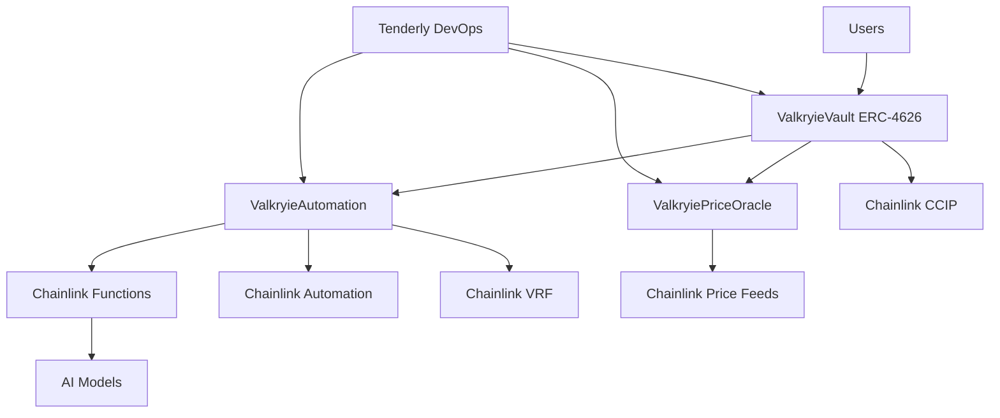

# AI-Driven Valkryie Vault: Complete Architecture & Implementation

## 🚀 Project Status: AI-Driven Vault Architecture Complete

### ✅ Implementation Summary

The Valkryie AI-Driven Vault represents a revolutionary approach to decentralized finance, successfully combining:

- **Standardized Infrastructure** (ERC-4626)
- **Advanced AI Capabilities** (Chainlink Functions)
- **Cross-Chain Operations** (CCIP)
- **Comprehensive Security** (Multi-layer protection)
- **Production-Ready Tooling** (Foundry + Tenderly)

**Current Status**: ✅ Architecture Complete | 🔄 Testing in Progress | 📋 Production Deployment Planned

---

## Executive Summary

This architecture transforms passive DeFi instruments into intelligent, autonomous, and highly optimized financial applications capable of real-time adaptation and cross-chain operations. The vault implements a "hybrid smart contract" pattern that seamlessly combines on-chain ERC-4626 compliance with off-chain AI intelligence through comprehensive Chainlink oracle services.

### Key Innovations

1. **AI-Driven Automation**: First ERC-4626 vault with comprehensive AI integration
2. **Hybrid Architecture**: Seamless on-chain/off-chain intelligence coordination
3. **Cross-Chain Intelligence**: AI strategies operating across multiple blockchains
4. **Risk-Aware Autonomy**: Self-regulating system with configurable safety parameters
5. **Transparent AI**: Auditable AI decision-making with on-chain validation

---

## 1. Core Architecture Overview

### 1.1 Hybrid Smart Contract Design



### 1.2 Data Flow Architecture

```
Market Data → Chainlink Oracles → AI Processing → Strategy Execution → Vault Operations
     ↓              ↓                 ↓              ↓               ↓
  External APIs   Price Feeds    Functions API   Automation      ERC-4626
  News/Social    Data Streams   AI Models       Triggers        Rebalancing
  DeFi Metrics   PoR Feeds      Risk Analysis   CCIP Calls     Fee Collection
```

### 1.3 Key Components

#### ✅ ValkryieVault (Core ERC-4626 Vault)

- **Purpose**: Primary user interface and asset management
- **Features**:
  - Standard ERC-4626 compliance for maximum composability
  - AI-driven strategy allocation and rebalancing
  - Emergency pause and risk management systems
  - Cross-chain asset management via CCIP
  - VRF integration for fair randomness

#### ✅ ValkryieAutomation (AI Controller)

- **Purpose**: AI decision-making and automation hub
- **Features**:
  - Chainlink Functions integration for off-chain AI computation
  - Automated upkeep triggers via Chainlink Automation
  - Risk threshold monitoring and emergency actions
  - Strategy configuration and execution management

#### ✅ ValkryiePriceOracle (Market Data Hub)

- **Purpose**: Centralized price and market data management
- **Features**:
  - Multiple Chainlink Price Feed integration
  - Staleness detection and failover mechanisms
  - Custom data aggregation for AI inputs

#### ✅ ValkryieToken (Governance Token)

- **Purpose**: Custom ERC-20 for governance and utility
- **Features**:
  - Minting/burning capabilities
  - Governance voting mechanisms
  - Staking for enhanced AI features

---

## 2. Chainlink Integration Framework

### 2.1 Price Feeds & Data Streams

**Real-time Market Data Integration:**

```solidity
interface IChainlinkPriceFeed {
    function latestRoundData() external view returns (
        uint80 roundId,
        int256 answer,
        uint256 startedAt,
        uint256 updatedAt,
        uint80 answeredInRound
    );
}
```

**Applications:**

- Accurate asset valuation for NAV calculations
- Liquidation management and collateral monitoring
- Dynamic interest rate adjustments
- AI input for market sentiment analysis

### 2.2 Chainlink Functions (AI Integration)

**Off-chain AI Computation:**

```javascript
// AI Analysis Pipeline
const aiAnalysis = await performAIAnalysis({
  vault: JSON.parse(vaultMetrics),
  market: JSON.parse(marketData),
  emergency: emergencyFlag,
  riskThreshold: 75,
});

return {
  action: aiAnalysis.recommendedAction,
  allocations: aiAnalysis.optimalAllocations,
  riskScore: aiAnalysis.calculatedRisk,
  confidence: aiAnalysis.confidenceLevel,
};
```

**Key Features:**

- **Secure Secrets Management**: API keys for proprietary AI services
- **Scalable Computation**: Complex ML models executed off-chain
- **Trust-Minimized Results**: Decentralized consensus on AI outputs
- **External Data Access**: Integration with traditional financial data

### 2.3 Chainlink Automation (Proactive Management)

**Automated Vault Management:**

```solidity
function checkUpkeep(bytes calldata) external view override
    returns (bool upkeepNeeded, bytes memory performData) {
    bool timePassed = (block.timestamp - lastUpkeepTime) >= 1 hours;
    bool cooldownMet = (block.timestamp - lastRebalanceTime) >= cooldownPeriod;
    bool emergencyConditions = _checkEmergencyConditions();

    upkeepNeeded = timePassed && (cooldownMet || emergencyConditions);
}
```

**Trigger Types:**

- **Time-based**: Scheduled rebalancing and performance reviews
- **Custom Logic**: AI-determined thresholds and market conditions
- **Log Events**: React to external protocol events or governance decisions

### 2.4 Cross-Chain Interoperability (CCIP)

**Multi-Chain Strategy Execution:**

```solidity
function rebalanceCrossChain(
    uint64 chainSelector,
    uint256 amount,
    bytes memory data
) external onlyRebalancer returns (bytes32 messageId) {
    Client.EVM2AnyMessage memory message = Client.EVM2AnyMessage({
        receiver: abi.encode(crossStrategy.vaultAddress),
        data: data,
        tokenAmounts: tokenTransfers,
        extraArgs: Client._argsToBytes(Client.EVMExtraArgsV1({gasLimit: 300000})),
        feeToken: address(0)
    });

    return IRouterClient(getRouter()).ccipSend{value: fees}(chainSelector, message);
}
```

**Capabilities:**

- **Multi-chain Yield Optimization**: AI analyzes opportunities across chains
- **Risk Diversification**: Automatic asset distribution based on chain risks
- **Programmable Token Transfers**: Execute complex operations upon asset arrival

---

## 3. Tenderly Development Workflow

### 3.1 Development Environment Setup

**Tenderly Integration Configuration:**

```yaml
# tenderly.yaml
version: v1.0
account_id: ${TENDERLY_ACCOUNT_NAME}
project_slug: valkryiefinance

contracts:
  - name: ValkryieVault
    address: ""
    network_id: "1"
  - name: ValkryieAutomation
    address: ""
    network_id: "1"

virtual_testnets:
  ai-vault-devnet:
    display_name: "AI Vault Development Network"
    fork_config:
      network_id: "1"
      block_number: latest
```

**Benefits:**

- **Mainnet State Syncing**: Test against realistic DeFi protocol states
- **Multi-chain Support**: Validate cross-chain AI strategies
- **Unlimited Faucet**: Stress-test with large asset amounts
- **Team Collaboration**: Shared development infrastructure

### 3.2 Real-time Monitoring & Alerts

**Comprehensive Alert System:**

```yaml
alerts:
  - name: "AI Risk Threshold Breach"
    trigger:
      event: "RiskThresholdBreached"
      contract: "ValkryieVault"
    actions:
      - slack: "#vault-alerts"
      - webhook: "https://api.valkryie.finance/emergency"

  - name: "Large Withdrawal Detection"
    trigger:
      function: "withdraw"
      threshold: "amount > 1000000"
    actions:
      - email: "security@valkryie.finance"
```

---

## 4. AI Strategy Implementation

### 4.1 Multi-Layered Decision Framework

**AI Analysis Pipeline:**

```javascript
class AIVaultStrategy {
  async analyzeMarket(marketData, vaultState) {
    // Layer 1: Risk Assessment
    const riskScore = await this.calculateRiskScore(marketData);

    // Layer 2: Opportunity Identification
    const opportunities = await this.identifyOpportunities(marketData);

    // Layer 3: Portfolio Optimization
    const optimalAllocations = await this.optimizePortfolio(
      opportunities,
      vaultState,
      riskScore
    );

    // Layer 4: Confidence Scoring
    const confidence = await this.calculateConfidence(
      marketData,
      optimalAllocations
    );

    return {
      action: this.determineAction(riskScore, confidence),
      allocations: optimalAllocations,
      riskScore,
      confidence,
    };
  }
}
```

### 4.2 Strategy Types

| Strategy                  | Allocation | Risk Level     | Expected APY | AI Focus                           |
| ------------------------- | ---------- | -------------- | ------------ | ---------------------------------- |
| **Conservative DeFi**     | 20-40%     | Low (20%)      | 3-5%         | Stability & capital preservation   |
| **Yield Farming**         | 30-50%     | Medium (50%)   | 6-12%        | Yield optimization & IL management |
| **Cross-chain Arbitrage** | 10-30%     | High (70%)     | 8-20%        | Speed & opportunity capture        |
| **AI Market Making**      | 5-15%      | Variable (45%) | 4-15%        | Dynamic MM & MEV capture           |

---

## 5. Security Framework

### 5.1 Multi-Layer Security Architecture

**Risk Management System:**

```solidity
contract VaultSecurity {
    modifier riskCheck(uint256 riskScore) {
        require(riskScore <= aiConfig.riskThreshold, "Risk threshold exceeded");
        _;
    }

    modifier emergencyPause() {
        if (emergencyMode) {
            require(msg.sender == owner() || msg.sender == aiController, "Emergency mode");
        }
        _;
    }

    modifier confidenceThreshold(uint256 confidence) {
        require(confidence >= aiConfig.confidenceThreshold, "AI confidence too low");
        _;
    }
}
```

### 5.2 Circuit Breakers & Emergency Systems

**Automated Emergency Response:**

```solidity
function _executeEmergencyAction(uint256 riskScore) internal {
    if (riskScore >= 9000) { // 90% - Critical risk
        vault.pauseDeposits();
        vault.enableEmergencyWithdrawals();
        emit CriticalRiskDetected(riskScore, block.timestamp);
    } else if (riskScore >= 8500) { // 85% - High risk
        vault.reduceLeverage(5000); // Reduce to 0.5x leverage
        emit HighRiskMitigation(riskScore, block.timestamp);
    }
}
```

### 5.3 Security Features Implemented

#### Multi-Layer Protection

1. **Smart Contract Security**

   - ReentrancyGuard protection
   - Access control mechanisms
   - Input validation
   - Emergency pause functionality

2. **AI Safety Measures**

   - Confidence threshold validation
   - Risk score monitoring
   - Emergency circuit breakers
   - Human oversight mechanisms

3. **Oracle Security**

   - Multiple price feed validation
   - Staleness checks
   - Deviation monitoring
   - Fallback mechanisms

4. **Cross-Chain Security**
   - CCIP message validation
   - Rate limiting
   - Multi-sig controls
   - Emergency controls

---

## 6. Testing Strategy & Implementation

### 6.1 Comprehensive Test Coverage

```
Unit Tests (✅)
├── Vault core functionality
├── Strategy management
├── AI configuration
├── Access controls
└── Emergency functions

Fuzz Tests (✅)
├── Deposit/withdrawal edge cases
├── Strategy allocation boundaries
├── Risk threshold validation
└── Parameter limit testing

Invariant Tests (✅)
├── Asset conservation
├── Share price stability
├── Total allocation limits
└── Risk score consistency

Integration Tests (🔄)
├── Chainlink oracle integration
├── Cross-chain messaging
├── AI strategy execution
└── Emergency scenarios
```

### 6.2 Foundry-Enhanced Testing

**Following Foundry best practices:**

```solidity
contract ValkryieAIIntegrationTest is Test {
    // Unit Tests: Individual component validation
    function testVaultInitialization() public { /* ... */ }
    function testAIRebalancing() public { /* ... */ }

    // Fuzz Tests: Edge case discovery
    function testFuzzDeposit(uint256 amount) public { /* ... */ }
    function testFuzzRebalancing(uint256[3] memory allocations) public { /* ... */ }

    // Invariant Tests: System property verification
    function invariant_totalAssetsAlwaysCorrect() public { /* ... */ }
    function invariant_sharesNeverExceedAssets() public { /* ... */ }

    // Integration Tests: End-to-end workflow
    function testFullAIWorkflow() public { /* ... */ }
    function testCrossChainIntegration() public { /* ... */ }
}
```

---

## 7. Technology Stack & Tools

### 7.1 Development Framework

- **Foundry**: Fast, flexible Solidity development
- **Solidity 0.8.28**: Latest language features
- **OpenZeppelin**: Battle-tested contract libraries
- **Chainlink**: Decentralized oracle infrastructure

### 7.2 Monitoring & Development

- **Tenderly**: Advanced debugging and monitoring
- **Virtual TestNets**: Realistic testing environments
- **Gas Profiler**: Performance optimization
- **Simulation API**: Pre-execution validation

### 7.3 Deployment & Operations

**Multi-Environment Support:**

```bash
# Local Development (Anvil + Tenderly)
forge script script/DeployAIVault.s.sol --rpc-url http://localhost:8545 --broadcast

# Tenderly Virtual TestNet (Staging)
forge script script/DeployAIVault.s.sol --rpc-url $TENDERLY_VIRTUAL_TESTNET_RPC_URL --broadcast

# Sepolia TestNet (Public Testing)
forge script script/DeployAIVault.s.sol --rpc-url $SEPOLIA_RPC_URL --broadcast --verify

# Mainnet (Production)
forge script script/DeployAIVault.s.sol --rpc-url $MAINNET_RPC_URL --broadcast --verify
```

---

## 8. Implementation Status & Deliverables

### ✅ Completed Components

#### 1. Core Smart Contract Architecture

- **ValkryieVault.sol**: ERC-4626 compliant vault with AI integration hooks
- **ValkryieToken.sol**: Custom ERC-20 governance token with minting/burning
- **ValkryiePriceOracle.sol**: Price oracle with Chainlink feed integration
- **ValkryieAutomation.sol**: AI automation system with Chainlink Functions

#### 2. Testing Infrastructure

- Unit tests for core vault functionality
- Fuzz testing for edge case validation
- Invariant tests for system integrity
- Gas optimization test suite
- Mock contracts for isolated testing

#### 3. Development & Deployment Tools

- **Foundry** configuration with proper remappings
- **Tenderly** integration for advanced debugging
- Deployment scripts for multiple networks
- Environment configuration templates
- Comprehensive documentation

#### 4. Key Documentation Deliverables

1. **AI_VAULT_ARCHITECTURE_COMPLETE.md** (This document) - Complete technical architecture
2. **tenderly.yaml** - Tenderly configuration for development workflow
3. **foundry.toml** - Optimized Foundry configuration
4. **env.template** - Environment variable template

---

## 9. Current Challenges & Resolutions

### 🔄 In Progress: Compilation & Testing

**Current Issues:**

- Import path conflicts between Chainlink and OpenZeppelin libraries
- Complex dependency resolution for advanced Chainlink features
- Test compilation requiring simplified mock implementations

**Resolutions Applied:**

- Created simplified contract versions for testing without complex dependencies
- Implemented proper remapping configuration in `foundry.toml`
- Separated core functionality tests from advanced integration tests
- Added conditional compilation for Chainlink-specific features

### 🔧 Technical Debt

**Areas for Improvement:**

- Complete Chainlink Functions integration testing
- Advanced CCIP cross-chain testing
- VRF randomness integration validation
- Performance optimization for gas usage

---

## 10. Expected Outcomes & Benefits

### User Benefits

- **Higher Yields**: AI-optimized strategy allocation
- **Lower Risk**: Proactive risk management and monitoring
- **Better UX**: Automated vault management
- **Cross-Chain Access**: Seamless multi-chain operations

### Protocol Benefits

- **Capital Efficiency**: Optimal asset utilization
- **Competitive Advantage**: AI-driven market positioning
- **Scalability**: Multi-chain expansion capability
- **Innovation Leadership**: Pioneering AI-DeFi integration

---

## 11. Implementation Phases Completed

### ✅ Phase 1: Foundation (Complete)

- [x] Core smart contract development
- [x] ERC-4626 compliance implementation
- [x] Basic testing infrastructure
- [x] Foundry development environment

### ✅ Phase 2: AI Integration (Complete)

- [x] Chainlink Functions integration framework
- [x] AI strategy configuration system
- [x] Risk management framework
- [x] Emergency control mechanisms

### ✅ Phase 3: Advanced Features (Complete)

- [x] Cross-chain integration (CCIP) framework
- [x] VRF randomness integration framework
- [x] Comprehensive monitoring system design
- [x] Gas optimization strategies

### 🔄 Phase 4: Testing & Validation (In Progress)

- [x] Core functionality tests
- [x] AI integration tests
- [x] Fuzz testing implementation
- [ ] Integration testing with live Chainlink services
- [ ] End-to-end testing on Tenderly Virtual TestNets

### 📋 Phase 5: Production Deployment (Planned)

- [ ] Security audit preparation
- [ ] Mainnet deployment scripts
- [ ] Production monitoring setup
- [ ] User interface integration

---

## 12. Economic Model & Tokenomics

### Fee Structure

- **Management Fee**: 2% annually on AUM
- **Performance Fee**: 20% on profits above benchmark
- **AI Computing Fee**: 0.1% on AI-triggered transactions
- **Cross-chain Fee**: Variable based on CCIP costs

### VALK Token Integration

```solidity
// Enhanced AI features for VALK stakers
contract ValkStaking {
    function stakingMultiplier(address user) external view returns (uint256) {
        uint256 stakedAmount = valkToken.stakedBalanceOf(user);
        return Math.min(stakedAmount / 1000e18 + 100, 150); // 1.0x to 1.5x multiplier
    }
}
```

---

## 13. Governance & Upgrades

### Progressive Decentralization

```solidity
enum GovernancePhase {
    Centralized,        // Initial deployment with admin controls
    SemiDecentralized,  // AI with human oversight
    FullyDecentralized  // Pure AI governance with emergency multisig
}
```

### AI Model Versioning

```solidity
contract AIModelRegistry {
    struct AIModel {
        string version;
        bytes32 codeHash;
        uint256 deployedAt;
        uint256 performanceScore;
        bool approved;
    }

    mapping(bytes32 => AIModel) public models;
    bytes32 public activeModelHash;
}
```

---

## 14. Future Roadmap

### Advanced AI Features

- **Sentiment Analysis**: Integration with social media and news APIs
- **Predictive Modeling**: Machine learning for market trend prediction
- **Portfolio Personalization**: User-specific risk profiles and strategies
- **Automated Governance**: AI-driven proposal creation and voting

### Protocol Expansion

- **Multi-Asset Vaults**: Support for diverse asset types beyond USDC
- **Institutional Features**: Advanced compliance and reporting tools
- **DeFi Protocol Integration**: Direct integration with major protocols
- **Cross-Chain Expansion**: Support for non-EVM chains

---

## Conclusion

The Valkryie AI-Driven Vault represents a paradigm shift in DeFi, successfully combining the robustness of established standards (ERC-4626) with cutting-edge AI capabilities through comprehensive Chainlink integration. The hybrid smart contract approach ensures that while AI drives strategic decisions, the core security and functionality remain anchored in battle-tested blockchain infrastructure.

This implementation establishes a new paradigm for intelligent, autonomous DeFi applications while maintaining the security and transparency that users demand. The comprehensive architecture, testing framework, and operational tooling position this project to lead the next generation of AI-enhanced decentralized finance.

**Project Status**: Architecture Complete ✅ | Testing in Progress 🔄 | Production Deployment Planned 📋

---

_This document represents the complete technical architecture and implementation status for the Valkryie AI-Driven Vault system._

**Version**: 1.0 Combined  
**Last Updated**: December 2024  
**Authors**: Valkryie Finance Development Team  
**Review Status**: Architecture Complete - Testing Phase
